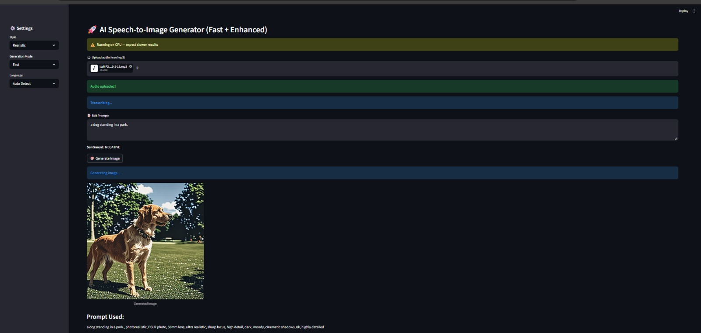

# 🎤 Speech-to-Image Generator

An AI-powered application that converts speech into images using deep learning models.

## 🚀 Features
- 🎧 Speech-to-text using Whisper
- 🧠 Sentiment analysis of input
- 🎨 Text-to-image generation using Stable Diffusion
- ⚡ Prompt enhancement for better image quality
- 🌐 Streamlit-based UI

## 🛠️ Tech Stack
- Python
- Streamlit
- Transformers (Whisper)
- Diffusers (Stable Diffusion)
- Torch

## 📸 Example
Input: "A dog standing in a park"

## 📸 Demo Output


## ⚠️ Note
Deployment may face issues due to Python 3.13 compatibility with certain ML libraries (tokenizers, PyO3).

## ▶️ Run Locally

```bash
pip install -r requirements.txt
streamlit run app.py
